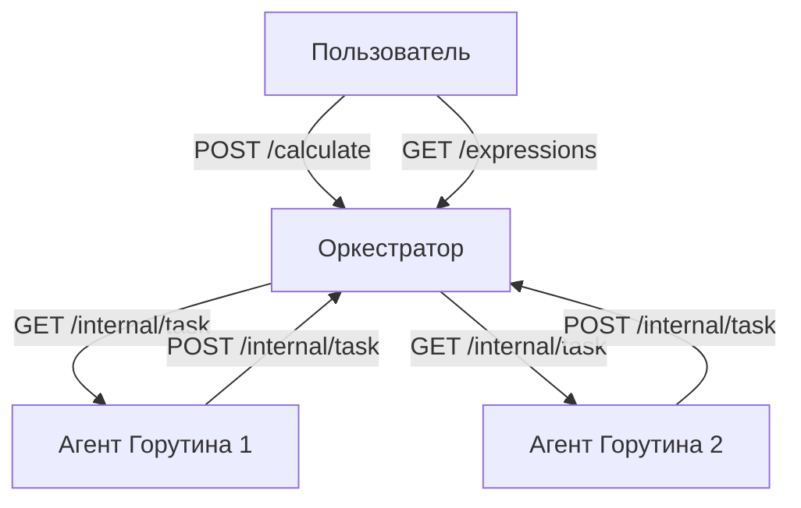

# Распределённый вычислитель арифметических выражений

Этот проект реализует веб-сервис, принимающий арифметическое выражение через HTTP запрос и возвращающий результат вычислений.

- Поддерживаемые операции: `+`, `-`, `*`, `/`
- Приоритет операций и скобки
- Параллельное выполнение операций
  
# Структура проекта
### cmd/ — точка входа приложения
### internal/ — внутренняя логика и модули приложения
### pkg/ — вспомогательные пакеты

# Архитектура

#### Сервис состоит из двух серверов: Оркестратора и Агента

- Оркестратор принимает выражения через HTTP запрос, разбивает выражения на подзадачи и хранит статусы вычислений

- Агент запускает несколько горутин, которые получают задачи через HTTP-запросы от Оркестратора, выполняют арифметические операции, возвращают результаты Оркестратору



# Инструкция по запуску:

#### Убедитесь, что у вас установлен Go (желательно версия 1.23.5 или выше).

## Скопируйте репозиторий:

```cmd
git clone https://github.com/Rail-KH/calc2
```

```cmd
cd calc2
```
