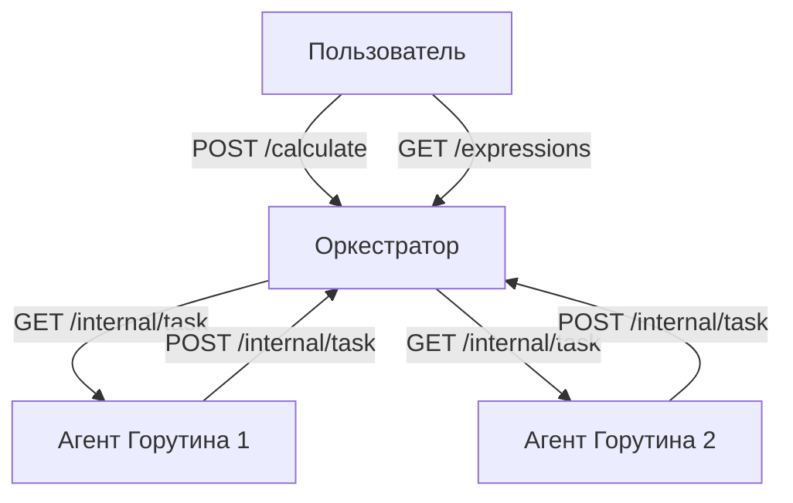

# Распределённый вычислитель арифметических выражений

Этот проект реализует веб-сервис, принимающий арифметическое выражение через HTTP запрос и возвращающий результат вычислений.

- Поддерживаемые операции: `+`, `-`, `*`, `/`
- Приоритет операций и скобки
- Параллельное выполнение операций
  
# Структура проекта
### cmd/ — точка входа приложения
### internal/ — внутренняя логика и модули приложения
### pkg/ — вспомогательные пакеты

# Архитектура

#### Сервис состоит из двух серверов: Оркестратора и Агента

- Оркестратор принимает выражения через HTTP запрос, разбивает выражения на подзадачи и хранит статусы вычислений

- Агент запускает несколько горутин, которые получают задачи через HTTP-запросы от Оркестратора, выполняют арифметические операции, возвращают результаты Оркестратору



# Инструкция по запуску:

#### Убедитесь, что у вас установлен Go (желательно версия 1.23.5 или выше).

## Скопируйте репозиторий:

~~~powershell
git clone https://github.com/Rail-KH/calc2
~~~

~~~powershell
cd calc2
~~~

## Запустите Оркестратор:

~~~powershell
# Установка времени операций (в миллисекундах)
$env:TIME_ADDITION_MS = "200"
$env:TIME_SUBTRACTION_MS = "200"
$env:TIME_MULTIPLICATIONS_MS = "300"
$env:TIME_DIVISIONS_MS = "400"

# Запуск оркестратора
go run .\cmd\orchestrator\main.go
~~~

## Запустите Агента:

~~~powershell
# Указание вычислительной мощности (количество горутин) и URL оркестратора
$env:COMPUTING_POWER = "4"
$env:ORCHESTRATOR_URL = "http://localhost:8080"

# Запуск агента
go run .\cmd\agent\main.go
~~~

# API Endpoints:

### 1. Добавление выражения

```bash
POST /api/v1/calculate
```

Пример запроса:

```bash
curl --location 'http://localhost:8080/api/v1/calculate' \
--header 'Content-Type: application/json' \
--data '{
  "expression": "(2+3)*4-10/2"
}'
```

Успешный ответ (201):

```json
{"id": "1"}
```

### 2. Получение списка выражений

```bash
GET /api/v1/expressions
```

Пример запроса:

```bash
curl --location 'localhost:8080/api/v1/expressions'
```

Пример ответа (200):

```json
{
    "expressions": [
        {
            "id": "1",
            "expression": "(2+3)*4-10/2",
            "status": "completed",
            "result": 15
        },
        {
            "id": "2",
            "expression": "8/(4-4)",
            "status": "in_progress",
            "result": null
        }
    ]
}
```

### 3. Получение выражения по ID

```bash
GET /api/v1/expressions/:id
```

Пример запроса:

```bash
curl --location 'localhost:8080/api/v1/expressions/:1'
```

Ответ (200):

```json
{
    {
    "expression": {
        "id": "1",
        "expression": "(2+3)*4-10/2",
        "status": "completed",
        "result": 15
    }
}
```

# Внутреннее API (для взаимодействия горутин Агента с Оркестратором)

### 1. Получение задачи

```bash
GET /internal/task
```

Пример ответа (200):

```json
{
    "task": {
        "id": "5",
        "arg1": 2,
        "arg2": 3,
        "operation": "+",
        "operation_time": 200
    }
}
```

### 2. Отправка результата

```bash
POST /internal/task
```

Пример запроса:

```json
{
  "id": "5",
  "result": 5
}
```

# Переменные окружения

### Оркестратор

- `PORT` - порт сервера (по умолчанию 8080)
- `TIME_ADDITION_MS` - время сложения (мс)
- `TIME_SUBTRACTION_MS` - время вычитания (мс)
- `TIME_MULTIPLICATIONS_MS` - время умножения (мс)
- `TIME_DIVISIONS_MS` - время деления (мс)

### Агент

- `ORCHESTRATOR_URL` - URL оркестратора
- `COMPUTING_POWER` - количество горутин

# Примеры сценариев

### Сценарий 1: Успешное вычисление

```bash
# Отправка выражения
curl --location 'http://localhost:8080/api/v1/calculate' \
--data '{"expression": "2+2*2"}'

# Проверка статуса
curl --location 'localhost:8080/api/v1/expressions/:1'

# Ответ:
{
    "expression": {
        "id": "1",
        "expression": "2+2*2"
        "status": "completed",
        "result": 6
    }
}
```

### Сценарий 2: Ошибка деления на ноль

```bash
curl --location 'http://localhost:8080/api/v1/calculate' \
--data '{"expression": "10/(5-5)"}'

# Проверка статуса
curl --location 'localhost:8080/api/v1/expressions/:2'

# Ответ(статус 200):
{
    "expression": {
        "id": "2",
        "expression": "10/(5-5)"
        "status": "in_progress",
        "result": null
    }
}
```

### Сценарий 3: Невалидные данные

```bash
curl --location 'http://localhost:8080/api/v1/calculate' \
--data '{"expression": "}'

# Ответ(статус 422):
{"error":"Invalid Body"}

```
# Тесты

#### Тест Агента

~~~powershell
cd calc2
go test .\internal\agent

# ok      github.com/Rail-KH/calc2/internal/agent 1.322s
~~~

#### Тест Оркестратора

~~~powershell
cd calc2
go test .\internal\orchestrator

# ok      github.com/Rail-KH/calc2/internal/orchestrator  1.145s
~~~

### Для запросов можно использовать программу Postman
